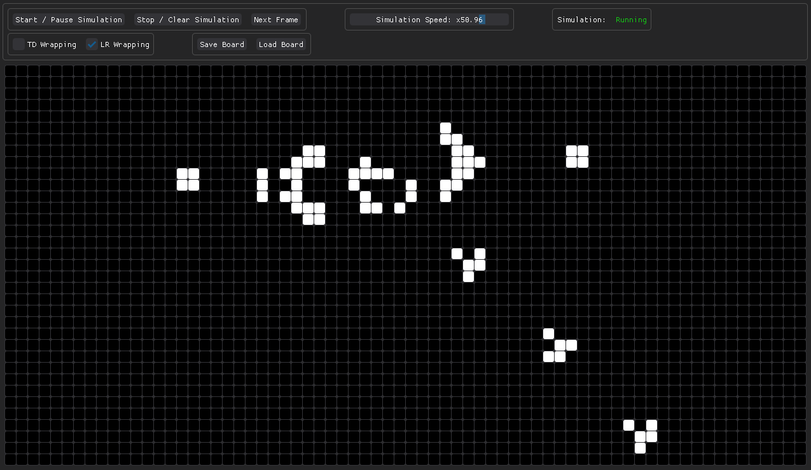

# DPG Conway's Game Of Life

---
### Features

- A 70 x 35 grid
- Start, Pause And Stop Button
- Next Frame
- Wrapping
- Changeable Refresh Rate, aka Simulation Speed (x0.5 to x100, where x1 = 1sec)
- Save and Load the board

---

---
### Thank you!

Thanks [DPG's](https://github.com/hoffstadt/DearPyGui) team for the hard work that you have put in this library!
